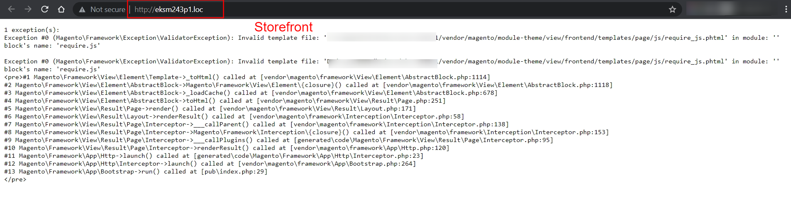
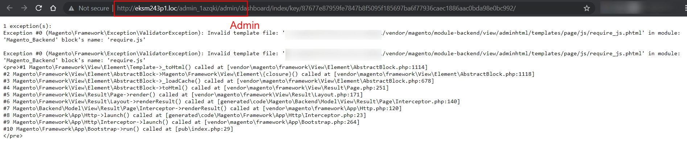
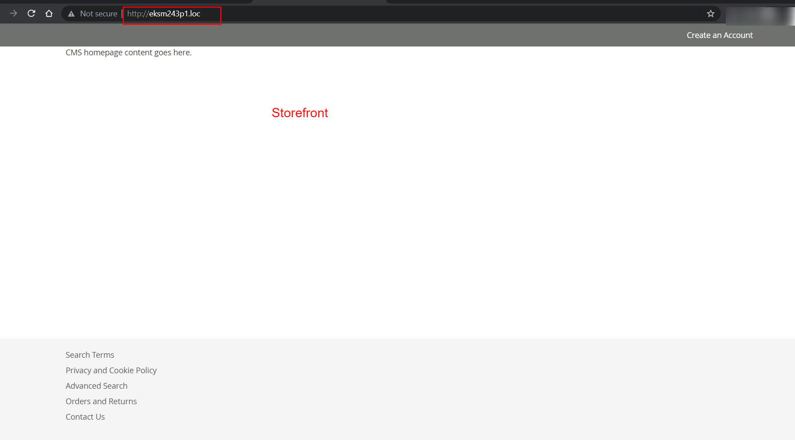
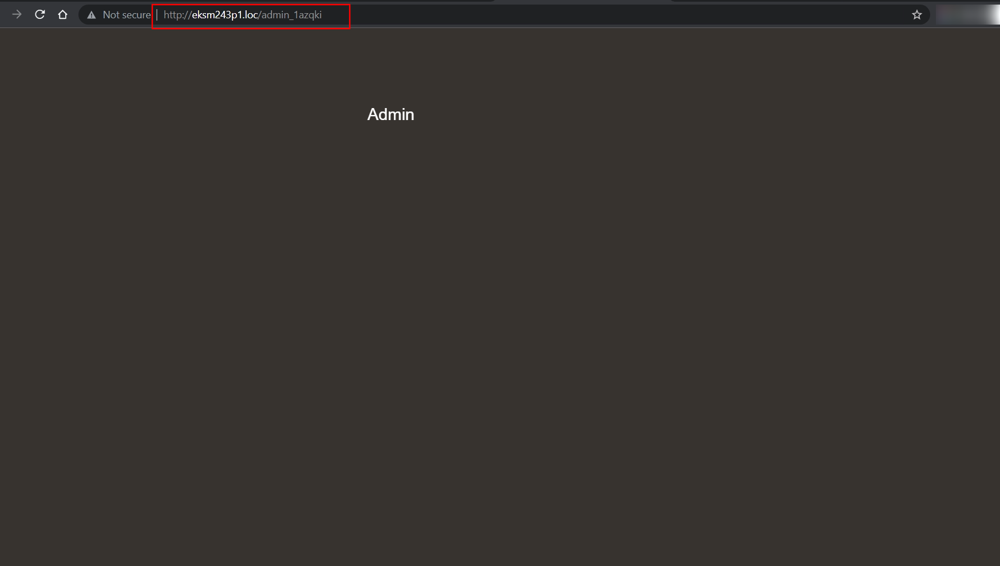

# Magento2.3 or greater version After installing getting blank screen or getting Exception
1 exception(s): Exception #0 (Magento\Framework\Exception\ValidatorException): Invalid template file: '...vendor/magento/module-theme/view/frontend/templates/page/js/require_js.phtml' in module: '' block's name: 'require.js'

# In developer Mode - with Exception 

# In default Mode - blank screen or not loading all data

